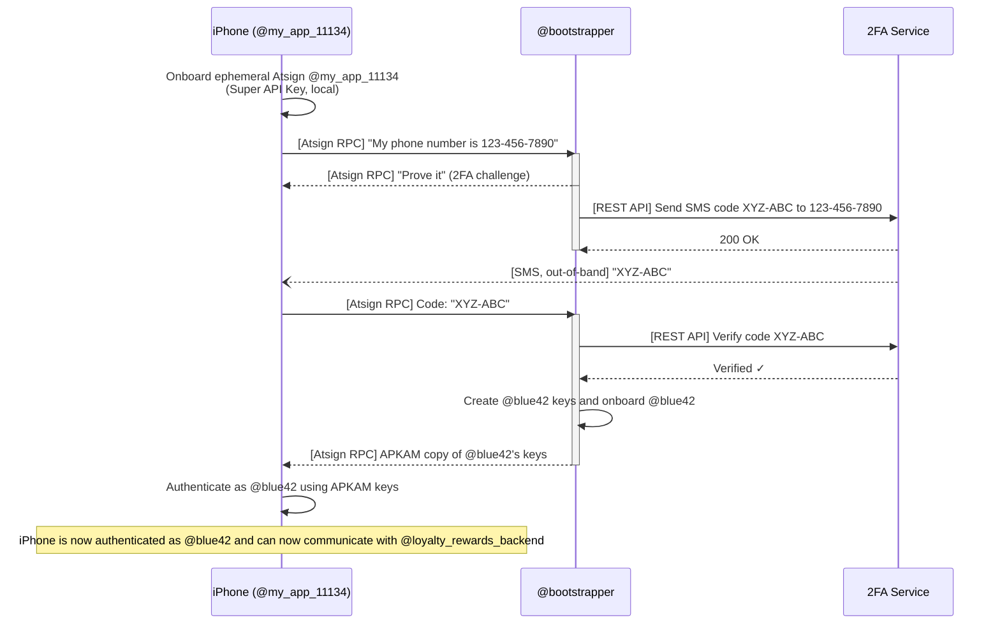
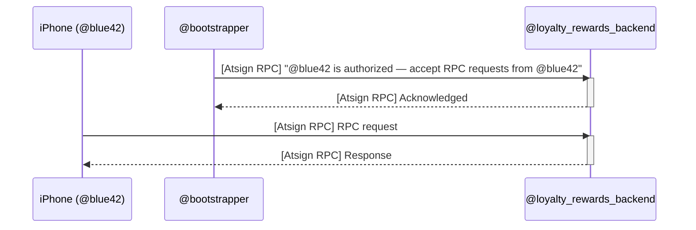
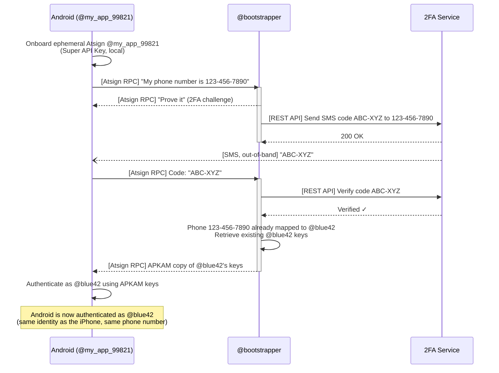

## Diagram 1: Bootstrapping (Phone Verification & Key Delivery)

```mermaid
sequenceDiagram
    participant iPhone as iPhone (@my_app_11134)
    participant backend as @bootstrapper
    participant twofa as 2FA Service

    iPhone->>iPhone: Onboard ephemeral Atsign @my_app_11134<br/>(Super API Key, local)

    iPhone->>backend: [Atsign RPC] "My phone number is 123-456-7890"
    activate backend

    backend-->>iPhone: [Atsign RPC] "Prove it" (2FA challenge)
    deactivate backend

    activate backend
    backend->>twofa: [REST API] Send SMS code XYZ-ABC to 123-456-7890
    twofa-->>backend: 200 OK
    deactivate backend

    twofa--)iPhone: [SMS, out-of-band] "XYZ-ABC"

    iPhone->>backend: [Atsign RPC] Code: "XYZ-ABC"
    activate backend

    backend->>twofa: [REST API] Verify code XYZ-ABC
    twofa-->>backend: Verified ✓

    backend->>backend: Create @blue42 keys and onboard @blue42
    backend-->>iPhone: [Atsign RPC] APKAM copy of @blue42's keys
    deactivate backend

    iPhone->>iPhone: Authenticate as @blue42 using APKAM keys

    Note over iPhone: iPhone is now authenticated as @blue42 and can now communicate with @loyalty_rewards_backend
```

## Diagram 2: Authorization Handoff

```mermaid
sequenceDiagram
    participant iPhone as iPhone (@blue42)
    participant bootstrapper as @bootstrapper
    participant loyalty as @loyalty_rewards_backend

    bootstrapper->>loyalty: [Atsign RPC] "@blue42 is authorized — accept RPC requests from @blue42"
    activate loyalty
    loyalty-->>bootstrapper: [Atsign RPC] Acknowledged
    deactivate loyalty

    iPhone->>loyalty: [Atsign RPC] RPC request
    activate loyalty
    loyalty-->>iPhone: [Atsign RPC] Response
    deactivate loyalty
```

## Diagram 3: New Device (Android) Claiming @blue42

```mermaid
sequenceDiagram
    participant Android as Android (@my_app_99821)
    participant bootstrapper as @bootstrapper
    participant twofa as 2FA Service

    Android->>Android: Onboard ephemeral Atsign @my_app_99821<br/>(Super API Key, local)

    Android->>bootstrapper: [Atsign RPC] "My phone number is 123-456-7890"
    activate bootstrapper

    bootstrapper-->>Android: [Atsign RPC] "Prove it" (2FA challenge)
    deactivate bootstrapper

    activate bootstrapper
    bootstrapper->>twofa: [REST API] Send SMS code ABC-XYZ to 123-456-7890
    twofa-->>bootstrapper: 200 OK
    deactivate bootstrapper

    twofa--)Android: [SMS, out-of-band] "ABC-XYZ"

    Android->>bootstrapper: [Atsign RPC] Code: "ABC-XYZ"
    activate bootstrapper

    bootstrapper->>twofa: [REST API] Verify code ABC-XYZ
    twofa-->>bootstrapper: Verified ✓

    bootstrapper->>bootstrapper: Phone 123-456-7890 already mapped to @blue42<br/>Retrieve existing @blue42 keys
    bootstrapper-->>Android: [Atsign RPC] APKAM copy of @blue42's keys
    deactivate bootstrapper

    Android->>Android: Authenticate as @blue42 using APKAM keys

    Note over Android: Android is now authenticated as @blue42<br/>(same identity as the iPhone, same phone number)
```
